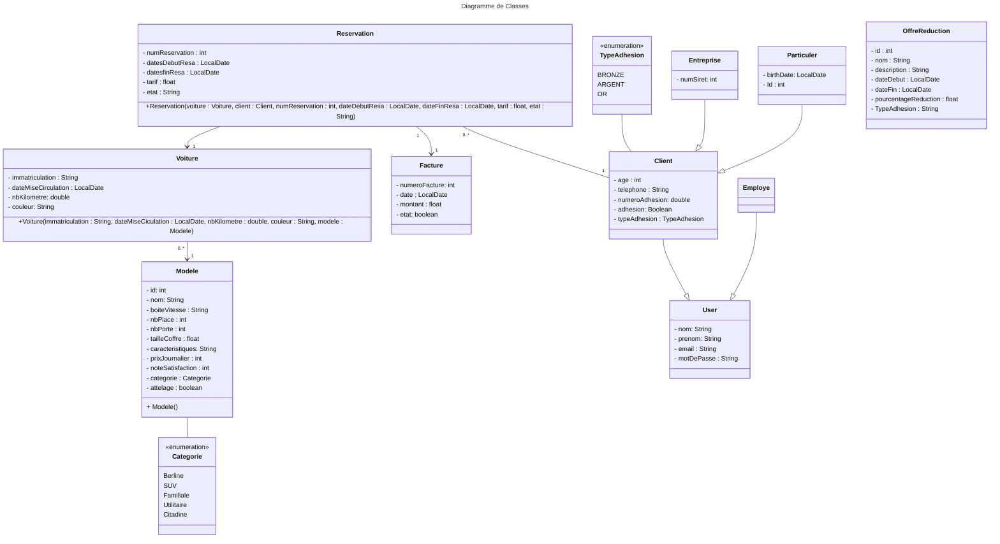

# :computer: Base-projet-Java

# Diagramme de Classes

```mermaid
---
title: Diagramme de Classes
---
classDiagram
    class Reservation{
        - numReservation : int
        - datesDebutResa : LocalDate
        - datesfinResa : LocalDate
        - tarif : float
        - etat : String
    
        +Reservation(voiture : Voiture, client : Client, numReservation : int, dateDebutResa : LocalDate, dateFinResa : LocalDate, tarif : float, etat : String)
    }
    
    class Voiture{
        - immatriculation : String
        - dateMiseCirculation : LocalDate
        - nbKilometre: double
        - couleur: String
    
        +Voiture(immatriculation : String, dateMiseCiculation : LocalDate, nbKilometre : double, couleur : String, modele : Modele)
    }
    
    class Modele{
        - id: int
        - nom: String
        - boiteVitesse : String
        - nbPlace : int
        - nbPorte : int
        - tailleCoffre : float
        - caracteristiques: String
        - prixJournalier : int
        - noteSatisfaction : int 
        - categorie : Categorie
        - attelage : boolean
    
        + Modele()
    }
    
    class Categorie{
        <<enumeration>>
        Berline
        SUV
        Familiale
        Utilitaire
        Citadine
    }
    
    class Facture{
        - numeroFacture: int
        - date : LocalDate
        - montant : float
        - etat: boolean
    }
    
    class Entreprise{
        - numSiret: int
    }
    
    class Particuler{
        - birthDate: LocalDate
        - Id : int 
    }
    
    class User{
        - nom: String
        - prenom: String
        - email : String
        - motDePasse : String
    }
    
    class Client{
        - age : int 
        - telephone : String
        - numeroAdhesion: double
        - adhesion: Boolean
        - typeAdhesion : TypeAdhesion
    }
    
    class TypeAdhesion{
        <<enumeration>>
        BRONZE
        ARGENT
        OR
    }
    
    class OffreReduction{
    - id : int
    - nom : String
    - description : String
    - dateDebut : LocalDate
    - dateFin : LocalDate
    - pourcentageReduction : float
    - TypeAdhesion : String
}
    
    Reservation "0..1" --> "1" Voiture
    Reservation "1" --> "1" Facture
    Reservation "0..*" -- "1" Client
    Voiture "0..*" --> "1" Modele
    Modele -- Categorie
    TypeAdhesion -- Client
    Client --|> User
    Employe --|> User
    Entreprise --|> Client
    Particuler --|> Client


```